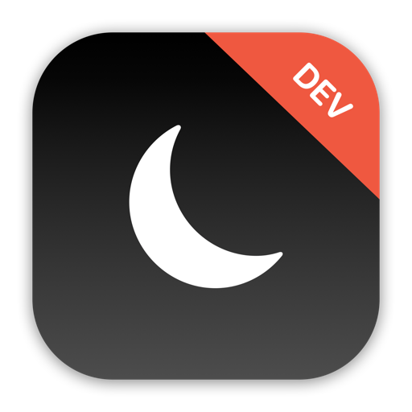

    

    
    
    

  ***Note**: The app icon above should only be used for development purposes only, not for submission to the App Store due to the license on SF Symbols and Emoji.*

 

SleepBetter is an app that is designed to help coffee drinkers get a good night’s sleep.

This app utilizes a technology that is built right into all iPhones; **Core ML** - it makes predictions about new data based on previous data it has seen. This process start with some raw sample data as its training data, then use the results to make accurate estimates about new data – all on device, and with complete privacy for users.

**Important: The training data model used in this app contains sample data only for the purpose of this project, and should not be used for actual health-related work.**

For the interface, the app features a simple form with 3 sections that requires the user input by asking the following 3 questions:

1. When do you want to wake up? - *7:30am, 8:00am, etc.*
2. Desired amount of sleep in hours? - *7, 8.5, etc.*
3. Daily coffee intake in cups? - *1 cup, 2 cups, etc.*

Once the app has all 3 input answers by the user, the most bottom section of the app will display the result of the user's ideal bedtime based on the input data above.

## App preview

https://user-images.githubusercontent.com/65307853/182377217-9dbe0fe8-3cfe-4a66-a5af-ff8f512a7af7.mp4

## Trying it yourself

SleepBetter is written using Xcode 13.2 and Swift 5.0. To try it out, you can clone this project and build it immediately by opening `SleepBetter.xcodeproj`.

As far as I know the app feature is complete, but there are likely to be errors all over the place at least to begin with – if you hit any problems, either building or running the app, please let me know.

## Important notes on usage

Keep in mind that this app is simply a project designed and built for my own personal educational purposes only. The sole purpose for this app project was to gain practical experience in building an app in iOS with Swift & SwiftUI. The state of this app was never meant to be production-ready, published onto the App Store, or to be monetized in any way, shape, or form.

If you wish to do any of the above, you will have to make some changes to the app before submitting to the App Store for approval. Please keep in mind of any potential violation of third-party license, such as the usage of SF Symbols and/or Emoji of the app icon.

## Credits

Swift, the Swift logo, Xcode, Instruments, SF Symbols, Emoji, Cocoa Touch, iPhone, iPad, Safari, App Store, watchOS, tvOS, Mac and macOS are trademarks of Apple Inc., registered in the U.S. and other countries.

## License 

This project is under the terms of the MIT license. For more information, please refer to the license [documentation](LICENSE).
